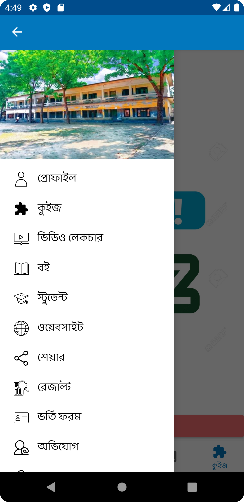

## General

This School-Management System App is Created in Android Studio using Java & Firebase.

<a id="raw-url" href="apk/SHS.apk?raw=true">
</a>

## Screenshots

|                                       Splash Screen                |                            Home                           |                            Navigation Drawer                           |
| :------------------------------------------------------------------: | :-----------------------------------------------------------------: | :------------------------------------------------------------------: |
|   |  |   |

## Dependencies

- Firebase Dependencies

```
implementation 'com.google.firebase:firebase-database:20.0.2'
implementation 'com.google.firebase:firebase-storage:20.0.0'
implementation 'com.google.firebase:firebase-messaging:22.0.0'
implementation 'androidx.legacy:legacy-support-v4:1.0.0'
implementation 'com.google.firebase:firebase-firestore:23.0.4'
implementation 'com.firebaseui:firebase-ui-firestore:7.1.1
```

- Others Dependencies

```
implementation 'androidx.navigation:navigation-fragment:2.3.5'
implementation 'androidx.navigation:navigation-ui:2.3.5'
implementation 'com.google.android.material:material:1.4.0'
implementation 'com.github.smarteist:autoimageslider:1.2.0'
implementation 'com.github.bumptech.glide:glide:4.12.0'
implementation platform('com.google.firebase:firebase-bom:26.0.0')
implementation 'com.google.firebase:firebase-analytics'
implementation 'de.hdodenhof:circleimageview:3.0.1'
implementation 'androidx.recyclerview:recyclerview:1.2.1'
implementation 'com.github.barteksc:android-pdf-viewer:2.8.2'
implementation 'com.github.chrisbanes:PhotoView:2.3.0'
implementation 'com.google.firebase:firebase-auth:21.0.1'
implementation 'com.facebook.shimmer:shimmer:0.5.0'
implementation 'com.github.kk121:File-Loader:1.2'
implementation 'com.android.support:multidex:1.0.3'
implementation 'com.github.GrenderG:Toasty:1.5.0'
implementation 'com.github.ybq:Android-SpinKit:1.4.0'
implementation 'com.hbb20:ccp:2.5.1'
implementation 'com.squareup.picasso:picasso:2.71828''
implementation 'androidx.appcompat:appcompat:1.3.1'
implementation "com.airbnb.android:lottie:3.4.0"
```
